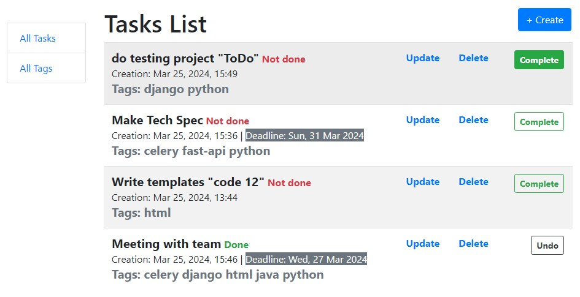

# Todo List 

Todo list is consist of tasks.

Each task has optionally deadline date.

And task can have multiple tags and a tag can be in multiple tasks.

___

### System requirements

* **Python 3.10+ (need to be installed)**
* Django 5.+ (will be install automatically )

## Installing 

1. Clone GitHub repository:
```
git clone https://github.com/u123dev/Todo.git
```
  - You can get the link by clicking the `Clone or download` button in your repo

2. Open the project folder in IDE
3. Make virtual environment and install requirements in it:
```
py -m venv venv
venv\Scripts\activate (on Windows)
source venv/bin/activate (on macOS)
pip install -r requirements.txt
```
4. Migrate & make database:
```
py manage.py migrate
```
4. Load demo data from fixture:
```
py manage.py loaddata data_db.json
```
5. Run project:
```
py manage.py runserver
```
7. Access Task Manager in browser: [http://127.0.0.1:8000/](http://127.0.0.1:8000/)

## Features
Home page provides a list of tasks with full information about each task.

Create new task by **`+ New Task`** button.

Button **`Complete`** if task is not done 
and **`Undo`** if a task is done  
changes the status of the task to the opposite.

### Functionality:
* **Tasks** - create, update, delete, view and set status.
* **Tags** - create, update, delete, view.

### Demo



### Contact
Feel free to contact: u123@ua.fm

